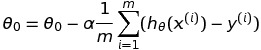

# Machine Learning Notes - Linear Regression

https://en.wikipedia.org/wiki/Linear_regression

https://en.wikipedia.org/wiki/Least_squares

https://en.wikipedia.org/wiki/Linear_least_squares_%28mathematics%29#Derivation_of_the_normal_equations

I used [this site](http://www.sciweavers.org/free-online-latex-equation-editor) to convert the math equations to images that I can embed in markdown.

### The hypothesis function

```latex
    h_\theta(x) = \theta_0 + \theta_1x
```

### The cost function (or MSE)

```latex
    J(\theta_0, \theta_1) = \frac{1}{2m} \sum_{i=1}^m (h_\theta(x^{(i)}) - y^{(i)})^2
```

### The gradient descent algorithm
    Repeat until convergence:


```latex
    \theta_j := \theta_j -  \alpha  \frac{\partial}{\partial \theta_j} J(\theta_0, \theta_1)
    for j = 0 and j = 1
```

### Gradient descent for linear regression



```latex
    \theta_0 = \theta_0 - \alpha \frac{1}{m} \sum_{i=1}^m (h_\theta(x^{(i)}) - y^{(i)})
    \theta_1 = \theta_1 - \alpha \frac{1}{m} \sum_{i=1}^m ((h_\theta(x^{(i)}) - y^{(i)}) x^{(i)})
```

I got the idea to use GPs to evolve the hypothesis function and then use gradient descent to get the dependent variables, and then minimise using the mean_squared_error cost function; this will help select the best hypothesis that fits the data correctly

### Handwritten Notes:


